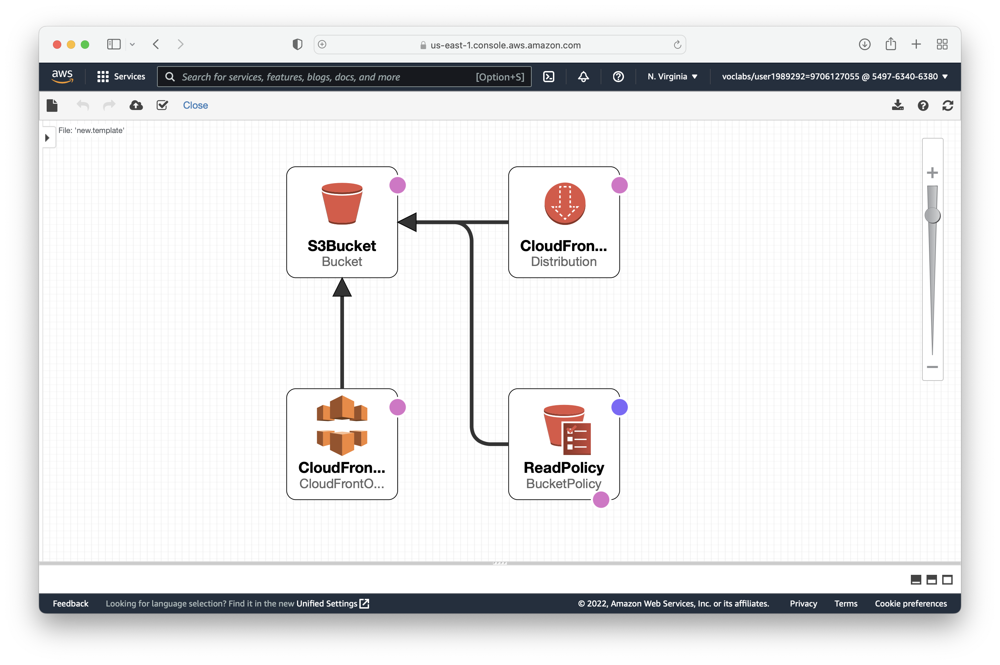

# Deploy A Static Site on AWS

## Build the infrastructure

The infrastructure includes a Stack consisting of a public S3 bucket.

The following image shows the infrastructure we are building.



To build the infrastructure run the following:

```zsh
$ ./build-infrastracture.sh
{
    "StackId": "arn:aws:cloudformation:us-east-1:549763406380:stack/static-site-stack/682d1830-e03f-11ec-8932-12e128654c27"
}
```

> **Note:** The output is an example of the output.

## Deploy the Static Site to S3

> Before moving to this step, make sure you have [built the infrastructure](#build-the-infrastructure).
> 
> To check if the infrastructure has been built use the following
> (the `StackStatus` would be `CREATE_COMPLETE`):
>
> ```zsh
> $ aws cloudformation describe-stacks --stack-name static-site-stack
> {
>     "Stacks": [
>         {
>             "StackId": "arn:aws:cloudformation:us-east-1:549763406380:stack/static-site-stack/682d1830-e03f-11ec-8932-12e128654c27",
>             "StackName": "static-site-stack",
>             "Parameters": [
>                 {
>                     "ParameterKey": "BucketName",
>                     "ParameterValue": "my-549763406380-bucket"
>                 }
>             ],
>             "CreationTime": "2022-05-30T17:40:44.762000+00:00",
>             "RollbackConfiguration": {},
>             "StackStatus": "CREATE_COMPLETE",
>             "DisableRollback": false,
>             "NotificationARNs": [],
>             "Outputs": [
>                 {
>                     "OutputKey": "S3BucketSecureURL",
>                     "OutputValue": "https://my-549763406380-bucket.s3.amazonaws.com"
>                 },
>                 {
>                     "OutputKey": "WebsiteURL",
>                     "OutputValue": "http://my-549763406380-bucket.s3-website-us-east-1.amazonaws.com",
>                     "Description": "URL for website hosted on S3"
>                 },
>                 {
>                     "OutputKey": "DistributionId",
>                     "OutputValue": "E1UX9Q0QWAX1P8",
>                     "Description": "CloudFront Distribution ID"
>                 },
>                 {
>                     "OutputKey": "Domain",
>                     "OutputValue": "d23wp0xw2ulvh8.cloudfront.net",
>                     "Description": "Cloudfront Domain"
>                 }
>             ],
>             "Tags": [],
>             "EnableTerminationProtection": false,
>             "DriftInformation": {
>                 "StackDriftStatus": "NOT_CHECKED"
>             }
>         }
>     ]
> }
> ```

Next, we need to upload the static webpage files to the S3 Bucket.

Move to the static site folder

```zsh
cd udacity-starter-website
```

Then copy the files to the s3 bucket.

```zsh
$ ./deploy.sh
{
    "ETag": "\"440ce1613878ee93164fb77fc6475a46\""
}
upload: vendor/bootstrap/.DS_Store to s3://my-549763406380-bucket/vendor/bootstrap/.DS_Store
upload: vendor/bootstrap/css/bootstrap-reboot.css to s3://my-549763406380-bucket/vendor/bootstrap/css/bootstrap-reboot.css
upload: vendor/bootstrap/css/bootstrap-reboot.min.css to s3://my-549763406380-bucket/vendor/bootstrap/css/bootstrap-reboot.min.css
upload: vendor/.DS_Store to s3://my-549763406380-bucket/vendor/.DS_Store              
upload: vendor/bootstrap/css/bootstrap-reboot.min.css.map to s3://my-549763406380-bucket/vendor/bootstrap/css/bootstrap-reboot.min.css.map
upload: vendor/bootstrap/css/bootstrap-grid.css to s3://my-549763406380-bucket/vendor/bootstrap/css/bootstrap-grid.css
upload: vendor/bootstrap/css/bootstrap-grid.min.css to s3://my-549763406380-bucket/vendor/bootstrap/css/bootstrap-grid.min.css
upload: vendor/bootstrap/css/bootstrap-reboot.css.map to s3://my-549763406380-bucket/vendor/bootstrap/css/bootstrap-reboot.css.map
...
```

## Get the links

The links can be found in the `describe-stacks` command as shown in the previous section on
[deploying the static site to s3](#deploy-the-static-site-to-s3).

The _Distribution URL_ takes a while before showing expected content but the other two links
are immediately available.

## Clean up

To clean all the resources built we use the file `delete-infrastructure.sh`.

It is contained in the root folder of the project and not in the static site template folder.

```zsh
$ cd ..
$ ./delete-infrastructure.sh
delete: s3://my-549763406380-bucket/vendor/.DS_Store
delete: s3://my-549763406380-bucket/css/clean-blog.css
delete: s3://my-549763406380-bucket/css/clean-blog.min.css
delete: s3://my-549763406380-bucket/vendor/bootstrap/css/bootstrap-grid.css.map
delete: s3://my-549763406380-bucket/img/taj_mahal.jpeg
delete: s3://my-549763406380-bucket/vendor/bootstrap/css/bootstrap-grid.min.css
delete: s3://my-549763406380-bucket/vendor/bootstrap/css/bootstrap-grid.css
delete: s3://my-549763406380-bucket/index.html
delete: s3://my-549763406380-bucket/img/.DS_Store
delete: s3://my-549763406380-bucket/vendor/bootstrap/.DS_Store
delete: s3://my-549763406380-bucket/vendor/bootstrap/css/bootstrap-reboot.css
delete: s3://my-549763406380-bucket/vendor/bootstrap/css/bootstrap-reboot.min.css
delete: s3://my-549763406380-bucket/vendor/bootstrap/css/bootstrap-reboot.css.map
...
```

